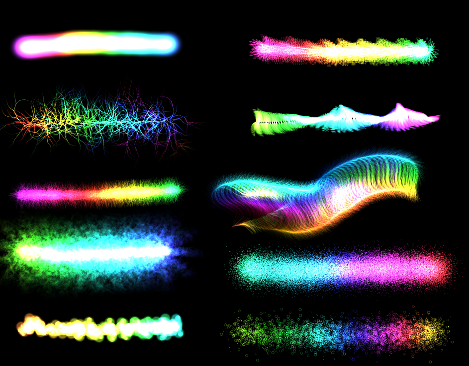

# Hikari-no-Crayon

キラッと光る線を重ねて描ける、加算合成ペイントツールです。  
クレヨンのやさしい描き心地に、ネオンみたいな発光エフェクトをミックス。  
ブラウザでサクッと遊べて、描くだけで作品がパッと映えるのがポイントです。

## Demo
- https://k0f1sh.github.io/hikari-no-crayon/

## Screenshot

## Development
1. Install dependencies:
   - `npm install`
2. Start dev server:
   - `npm run dev`
3. Build production bundle:
   - `npm run build`
4. Preview production build:
   - `npm run preview`
5. Run type check:
   - `npm run typecheck`

## Modernization Notes
- Legacy source is kept in `hc.js` and `hc.css` for reference.
- Current runtime entry is `index.html` + `src/main.ts`.
- `jQuery` and `underscore` dependencies were removed from runtime code.
- Source is split into:
  - `src/core` (state, draw, color, math)
  - `src/tools` (pen implementations)
  - `src/effects` (effect implementations)
  - `src/ui` (DOM bindings)
- Baseline smoke checks are documented in `docs/baseline-smoke-checklist.md`.
